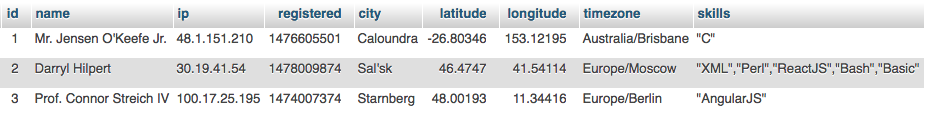
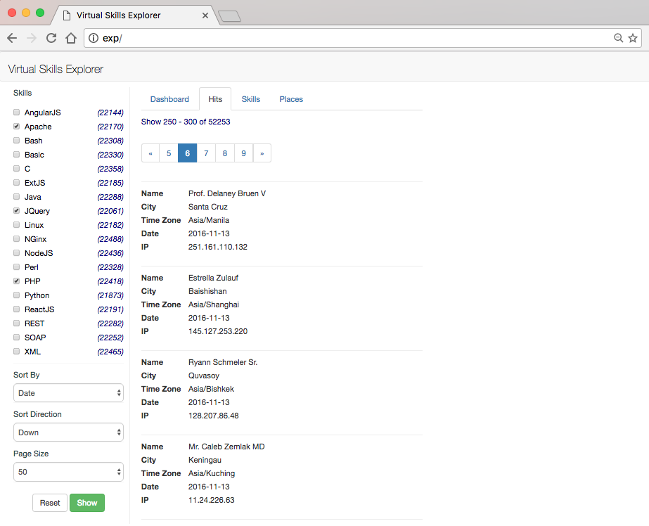
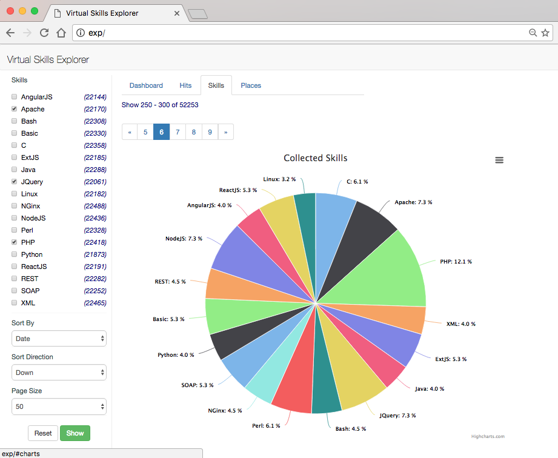
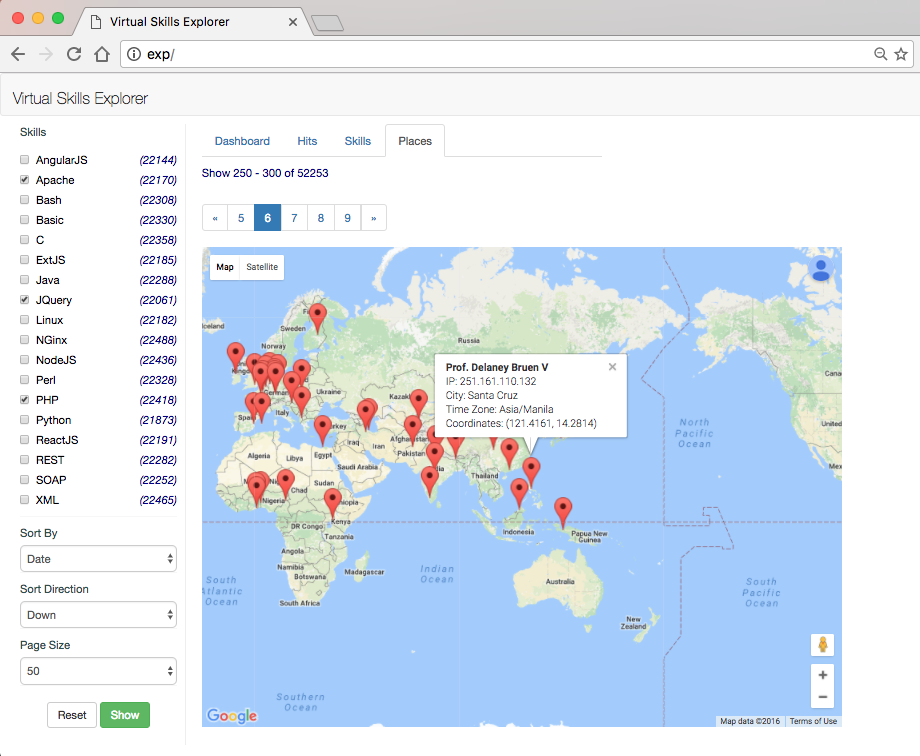

# ElasticSearch vs MySQL vs MongoDB

*Сравнение времени выполнения запросов к разным типам баз данных.*

Тестирование проводилось на виртуальной машине Oracle VM VirtualBox 5.1 

**Параметры хост системы:**

Элемент | Харакеристика
------------ | -------------
OS | MacOS Sierra 10.12.1
RAM | 8ГБ
CPU | 2,6 GHz Intel Core i5
HDD | SSD 120ГБ, SATA


**Параметры гостевой системы:**

Элемент | Харакеристика
------------ | -------------
ОS | Linux Fedora 24 (64-bit)
RAM | 2ГБ
CPU | 2
HDD | 8ГБ 

Сгенерированные записи содержали одинаковые данные для всех типов баз данных. 
Общее количество записей - 100000 (для экономии места). Включен виртуальный хост `http://exp/` для доступа к UI из браузера на хост машине.

### Структура (mapping) ElasticSearch:

```sh
GET /skills/programmers/_mapping?pretty
```

```json
{
  "skills": {
    "mappings": {
      "programmers": {
        "properties": {
          "city": {
            "type": "string"
          },
          "ip": {
            "type": "string",
            "index": "not_analyzed"
          },
          "location": {
            "type": "geo_point"
          },
          "name": {
            "type": "string"
          },
          "registered": {
            "type": "date",
            "format": "strict_date_optional_time||epoch_millis"
          },
          "skills": {
            "type": "string",
            "copy_to": [
              "skills_list"
            ]
          },
          "skills_list": {
            "type": "string",
            "index": "not_analyzed"
          },
          "timezone": {
            "type": "string"
          }
        }
      }
    }
  }
}
```


#### Пример тестовых данных

```sh
GET /skills/programmers/_search?pretty -d
{
  "size": 3
}
```

Данные, отсортированные по релевантности

```json
{
  "took": 3,
  "timed_out": false,
  "_shards": {
    "total": 5,
    "successful": 5,
    "failed": 0
  },
  "hits": {
    "total": 99999,
    "max_score": 1,
    "hits": [
      {
        "_index": "skills",
        "_type": "programmers",
        "_id": "AVhnegLRWNTWw7qAKLEL",
        "_score": 1,
        "_source": {
          "name": "Vince Kreiger",
          "city": "Tremembe",
          "location": {
            "lat": -22.95833,
            "lon": -45.54944
          },
          "timezone": "America/Sao_Paulo",
          "registered": "2016-10-08",
          "ip": "83.215.48.253",
          "skills": [
            "REST",
            "JQuery",
            "Linux",
            "ReactJS",
            "Java",
            "SOAP"
          ]
        }
      },
      {
        "_index": "skills",
        "_type": "programmers",
        "_id": "AVhnegLRWNTWw7qAKLEO",
        "_score": 1,
        "_source": {
          "name": "Johnathan Schuster",
          "city": "Tipasa",
          "location": {
            "lat": 36.58972,
            "lon": 2.4475
          },
          "timezone": "Africa/Algiers",
          "registered": "2016-10-05",
          "ip": "147.165.190.2",
          "skills": [
            "SOAP",
            "JQuery",
            "Perl",
            "REST",
            "Linux"
          ]
        }
      },
      {
        "_index": "skills",
        "_type": "programmers",
        "_id": "AVhnegLRWNTWw7qAKLEQ",
        "_score": 1,
        "_source": {
          "name": "Loyal Bins",
          "city": "Boldumsaz",
          "location": {
            "lat": 42.12824,
            "lon": 59.67101
          },
          "timezone": "Asia/Ashgabat",
          "registered": "2016-07-05",
          "ip": "233.251.138.80",
          "skills": [
            "Java",
            "NGinx",
            "Perl",
            "SOAP",
            "NodeJS",
            "C"
          ]
        }
      }
    ]
  }
}
```
Объем данных ~27МБ.

### Структура MySQL (денормализованная)


```sql
CREATE TABLE `programmers_denormalized` (
 `id` int(11) NOT NULL AUTO_INCREMENT,
 `name` varchar(64) COLLATE utf8_unicode_ci NOT NULL,
 `ip` varchar(20) COLLATE utf8_unicode_ci NOT NULL,
 `registered` bigint(20) NOT NULL,
 `city` varchar(100) COLLATE utf8_unicode_ci NOT NULL,
 `latitude` double NOT NULL,
 `longitude` double NOT NULL,
 `timezone` varchar(40) COLLATE utf8_unicode_ci NOT NULL,
 `skills` varchar(255) COLLATE utf8_unicode_ci NOT NULL,
 PRIMARY KEY (`id`),
 KEY `registered` (`registered`) USING BTREE,
 FULLTEXT KEY `skills` (`skills`)
) ENGINE=InnoDB DEFAULT CHARSET=utf8 COLLATE=utf8_unicode_ci;
```
#### Пример тестовых данных

```sql
SELECT * FROM programmers_denormalized LIMIT 3
```



Объем данных ~19МБ.


### Структура связанных таблиц MySQL

```sql
CREATE TABLE `programmers_normalized` (
 `id` int(11) NOT NULL AUTO_INCREMENT,
 `name` varchar(64) COLLATE utf8_unicode_ci NOT NULL,
 `ip` varchar(20) COLLATE utf8_unicode_ci NOT NULL,
 `registered` bigint(20) NOT NULL,
 `city` varchar(100) COLLATE utf8_unicode_ci NOT NULL,
 `latitude` double NOT NULL,
 `longitude` double NOT NULL,
 `timezone` varchar(40) COLLATE utf8_unicode_ci NOT NULL,
 PRIMARY KEY (`id`),
 KEY `registered` (`registered`) USING BTREE
) ENGINE=InnoDB DEFAULT CHARSET=utf8 COLLATE=utf8_unicode_ci;

CREATE TABLE `skills` (
 `id` int(11) NOT NULL AUTO_INCREMENT,
 `skill` varchar(20) COLLATE utf8_unicode_ci NOT NULL,
 PRIMARY KEY (`id`),
 KEY `skill` (`skill`)
) ENGINE=InnoDB DEFAULT CHARSET=utf8 COLLATE=utf8_unicode_ci;

CREATE TABLE `skills_relations` (
 `person` int(11) NOT NULL,
 `skill` int(11) NOT NULL,
 KEY `person_constraints1` (`person`),
 KEY `skill_constraints1` (`skill`),
 CONSTRAINT `person_constraints1` FOREIGN KEY (`person`) REFERENCES `programmers_normalized` (`id`) ON DELETE CASCADE,
 CONSTRAINT `skill_constraints1` FOREIGN KEY (`skill`) REFERENCES `skills` (`id`) ON DELETE CASCADE
) ENGINE=InnoDB DEFAULT CHARSET=utf8 COLLATE=utf8_unicode_ci;
```

#### Пример тестовых данных

```sql
SELECT DISTINCT p.*, (SELECT GROUP_CONCAT(s1.skill) FROM skills_relations sr1 JOIN skills s1 ON sr1.skill=s1.id WHERE sr1.person=p.id) skills FROM skills_relations sr JOIN programmers_normalized p ON p.id=sr.person JOIN skills s ON s.id=sr.skill LIMIT 3
```


Объем данных ~42МБ.


### Технологии

Тестовая программа написана с использованием [Laravel 5](https://laravel.com/). Для компиляции ассетов необходим установленный `npm`, `Node.js`, `gulp` и тд (см. документацию [Laravel Elixir](https://laravel.com/docs/5.0/elixir)).
На UI странице подключены [JQuery](https://jquery.com/), [Bootstrap](http://getbootstrap.com/), [HighCharts](http://www.highcharts.com/) и [GoogleMap](https://developers.google.com/maps/documentation/javascript/).

**Версии компонентов:**

Продукт | Версия
-------- | ---------
PHP | 5.6.27
Zend OPcache| 7.0.6
MySQL | MariaDB Server 10.1.18
ElasticSearch | 2.4
Apache | 2.4.23

### Скриншоты








### Apache Bench

POST данные взяты из локального файла и соответствуют настройкам поиска на скриншотах выше.
Перед каждым тестом очищался кэш.

```sh
$ php artizan cache:clear
$ ab -n 10000 -c 10 -T 'application/x-www-form-urlencoded' -p post_data.txt http://exp/filter
```

Подключение нового дата провайдера производилось вручную, в файле `app/Http/Controllers/Controller.php`:

```php
 abstract class Controller extends BaseController {
 
 	use DispatchesCommands, ValidatesRequests;
 
     protected $person = null;
 
     public function __construct()
     {
         $this->person = new ProgrammerRepository(new ProgrammerElasticStorage());
     }
 }
```

**Результаты тестов ElasticSearch**

```sh
This is ApacheBench, Version 2.3 <$Revision: 1748469 $>
Copyright 1996 Adam Twiss, Zeus Technology Ltd, http://www.zeustech.net/
Licensed to The Apache Software Foundation, http://www.apache.org/

Benchmarking exp (be patient)


Server Software:        Apache/2.4.23
Server Hostname:        exp
Server Port:            80

Document Path:          /filter
Document Length:        12324 bytes

Concurrency Level:      10
Time taken for tests:   62.151 seconds
Complete requests:      10000
Failed requests:        0
Non-2xx responses:      10000
Total transferred:      126000000 bytes
Total body sent:        2920000
HTML transferred:       123240000 bytes
Requests per second:    160.90 [#/sec] (mean)
Time per request:       62.151 [ms] (mean)
Time per request:       6.215 [ms] (mean, across all concurrent requests)
Transfer rate:          1979.82 [Kbytes/sec] received
                        45.88 kb/s sent
                        2025.70 kb/s total

Connection Times (ms)
              min  mean[+/-sd] median   max
Connect:        0    0   0.0      0       3
Processing:    10   62  30.4     59     249
Waiting:        8   48  26.0     44     214
Total:         10   62  30.4     59     249

Percentage of the requests served within a certain time (ms)
  50%     59
  66%     71
  75%     80
  80%     86
  90%    103
  95%    118
  98%    134
  99%    146
 100%    249 (longest request)
```
**Результаты тестов MySQL**

```
This is ApacheBench, Version 2.3 <$Revision: 1748469 $>
Copyright 1996 Adam Twiss, Zeus Technology Ltd, http://www.zeustech.net/
Licensed to The Apache Software Foundation, http://www.apache.org/

Benchmarking exp (be patient)


Server Software:        Apache/2.4.23
Server Hostname:        exp
Server Port:            80

Document Path:          /filter
Document Length:        12324 bytes

Concurrency Level:      10
Time taken for tests:   60.820 seconds
Complete requests:      10000
Failed requests:        0
Non-2xx responses:      10000
Total transferred:      126000000 bytes
Total body sent:        2920000
HTML transferred:       123240000 bytes
Requests per second:    164.42 [#/sec] (mean)
Time per request:       60.820 [ms] (mean)
Time per request:       6.082 [ms] (mean, across all concurrent requests)
Transfer rate:          2023.13 [Kbytes/sec] received
                        46.89 kb/s sent
                        2070.01 kb/s total

Connection Times (ms)
              min  mean[+/-sd] median   max
Connect:        0    0   0.0      0       1
Processing:    10   61  28.2     58     217
Waiting:        8   47  24.3     44     216
Total:         10   61  28.2     58     217

Percentage of the requests served within a certain time (ms)
  50%     58
  66%     69
  75%     77
  80%     83
  90%     99
  95%    112
  98%    128
  99%    138
 100%    217 (longest request)
```

**Результаты тестов MySQL (денормализованная)**
```
This is ApacheBench, Version 2.3 <$Revision: 1748469 $>
Copyright 1996 Adam Twiss, Zeus Technology Ltd, http://www.zeustech.net/
Licensed to The Apache Software Foundation, http://www.apache.org/

Benchmarking exp (be patient)


Server Software:        Apache/2.4.23
Server Hostname:        exp
Server Port:            80

Document Path:          /filter
Document Length:        12324 bytes

Concurrency Level:      10
Time taken for tests:   60.992 seconds
Complete requests:      10000
Failed requests:        0
Non-2xx responses:      10000
Total transferred:      126000000 bytes
Total body sent:        2920000
HTML transferred:       123240000 bytes
Requests per second:    163.96 [#/sec] (mean)
Time per request:       60.992 [ms] (mean)
Time per request:       6.099 [ms] (mean, across all concurrent requests)
Transfer rate:          2017.44 [Kbytes/sec] received
                        46.75 kb/s sent
                        2064.19 kb/s total

Connection Times (ms)
              min  mean[+/-sd] median   max
Connect:        0    0   0.1      0       7
Processing:    10   61  27.9     58     204
Waiting:        8   47  24.1     44     194
Total:         10   61  27.9     58     204

Percentage of the requests served within a certain time (ms)
  50%     58
  66%     70
  75%     78
  80%     83
  90%    100
  95%    112
  98%    124
  99%    135
 100%    204 (longest request)
```
